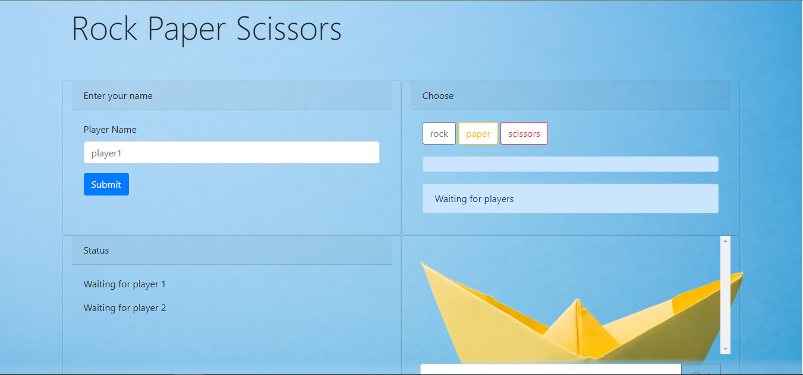

# Rock Paper Scissors

Search for the gifs you want to see using the GIPHY API.

## Getting Started

You can find the game at this link: 
[Rock Paper Scissors](https://liangbryan2.github.io/RPS-Multiplayer/)

### Prerequisites

This site was tested on Google Chrome but should work on any internet browser.

```
Google Chrome
Firefox
Microsoft Edge
etc.
```
## Main Goal

The main goal of this project was to create the game rock, paper, scissors, using the Firebase database. This game is a multiplayer game, so we need to keep track of other user's inputs and display them across any browser that has the page open. 
### Images




### Code Snippets
JavaScript 

Here we have the function rps, or rock paper scissors. You have your standard rules, rock beats scisors, scissors beats paper, and paper beats rock. I have the wins and losses being updated after we compare the two player's choices. 
``` js
function rps(one, two) {
    if (one === two) {
        database.ref("/outcome").set("It's a tie!");
    } else if (one === "rock") {
        if (two === "paper") {
            database.ref("/players/player1/losses").set(player1.losses + 1);
            database.ref("/players/player2/wins").set(player2.wins + 1);
            database.ref("/outcome").set("Player 2 wins!");
        } else if (two === "scissors") {
            database.ref("/players/player1/wins").set(player1.wins + 1);
            database.ref("/players/player2/losses").set(player2.losses + 1);
            database.ref("/outcome").set("Player 1 wins!");
        }
    } else if (one === "paper") {
        if (two === "scissors") {
            database.ref("/players/player1/losses").set(player1.losses + 1);
            database.ref("/players/player2/wins").set(player2.wins + 1);
            database.ref("/outcome").set("Player 2 wins!");
        } else if (two === "rock") {
            database.ref("/players/player1/wins").set(player1.wins + 1);
            database.ref("/players/player2/losses").set(player2.losses + 1);
            database.ref("/outcome").set("Player 1 wins!");
        }
    } else if (one === "scissors") {
        if (two === "rock") {
            database.ref("/players/player1/losses").set(player1.losses + 1);
            database.ref("/players/player2/wins").set(player2.wins + 1);
            database.ref("/outcome").set("Player 2 wins!");
        } else if (two === "paper") {
            database.ref("/players/player1/wins").set(player1.wins + 1);
            database.ref("/players/player2/losses").set(player2.losses + 1);
            database.ref("/outcome").set("Player 1 wins!");
        }
    }
    database.ref("/turn").set(1);
}
```

CSS

The site is 90% bootstrap, so there is not much CSS to marvel at.


HTML

As you can tell, a lot of Bootstrap classes for their predefined styling.
``` html
<div class="col card">
    <div class="card-header">
        Choose
    </div>
    <div class="card-body">
        <button type="button" class="rps btn btn-outline-secondary" data-rps="rock">rock</button>
        <button type="button" class="rps btn btn-outline-warning" data-rps="paper">paper</button>
        <button type="button" class="rps btn btn-outline-danger" data-rps="scissors">scissors</button>
        <div class="alert alert-primary" id="outcome" role="alert"></div>
        <div class="alert alert-primary" id="status" role="alert"></div>
    </div>
</div>
```

The HTML is very plain for this project because the goal was to add dynamically generated divs to the DOM as the user searches or presses buttons.


## Built With

* HTML
* JavaScript / [jQuery](https://jquery.com/)
* CSS / [Bootstrap](https://getbootstrap.com/)
* [Firebase](https://firebase.google.com/)

## Learning Points

This one was a challenge. I started off trying to learn how to use the Firebase authentication system so I could have two users connected and pull the inputs off of which user did what. But that did not turn out the way I wanted. I could not sort through the documentation to find what I wanted to do, so I took a different approach. I used data that was only on a specific user's browser like the name they enter. I then hid that so they could not change their name. A problem that came up when I was testing was that if another person uses the same name as player one, they could choose for player one. So I implemented a counter to check if the name already exists, add 1 to the name. 

## Author

**Bryan Liang** - [My Github](https://github.com/liangbryan2)

## License

This project is licensed under the MIT License - see the [LICENSE.md](LICENSE.md) file for details

## Acknowledgements

[UC Berkeley Extension](https://extension.berkeley.edu/)